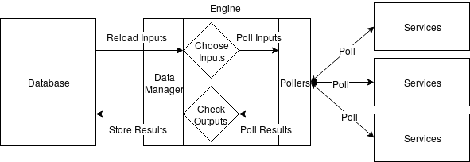
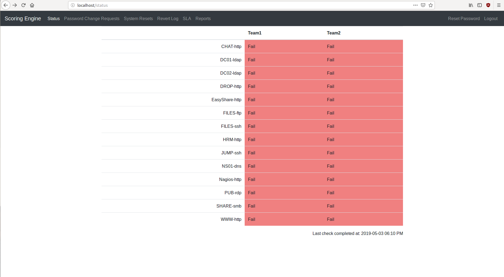

# CCDC Scoring Engine

This is the [CCDC](http://nationalccdc.org) Scoring Engine used for the DSU Defensive Security Club's Mock Competitions.

## Information

#### Logical Architecture



#### Main Page of Scoring Engine



This project is composed of a few important parts.

```
├── docs # Documentation
├── install # Various files for ./install.sh to use
├── install.sh # __Install script__. Installs dependencies and installs services.
├── LICENSE
├── README.md
└── scoring # Main folder. Contains everything needed for scoring.
    ├── checkfiles # Contains temporary files created in checks
        └── ...
    ├── configs # Contains example configurations. Write yours in here.
        └── ...
    ├── data_model.py # class that lays out "DataModel" object. Stores all data and manages db
    ├── db.creds
    ├── db.py # Contains functions for MySQL database access
    ├── db_writer.py # Contains specialized functions for writing scoring data to database
    ├── engine
        ├── polling # Contains poller files, which interact with system services
        ├── checker # Contains check files. Checks take poll results and return true or false
        └── ...
    ├── etc # Contains files needed to run scoring engine services (pid and conf files)
        └── ...
    ├── load_config.py # Loads a given config, deletes database beforehand
    ├── schema.sql # Contains layout of MySQL database backend
    ├── service.py # Starts password change request servicer
    ├── start_engine.py # Defines ScoringEngine class and starts scoring engine
    ├── stop_engine.py # Stops scoring engine (sets db value "running" to False)
    ├── ialab.py # Orchestrates ialab integration (DSU specific)
    ├── utils.py # Loads a given module by string.
    ├── validate.py # Validater utils file. Validates inputs
    ├── web # Contains flask files to create and run web server
        └── ...
    └── wsgi.py # Runs wsgi web server (flask)
├── scripts # Contains various scripts not needed for scoring engine
└── setup.py
```

## Installation and Setup

> Note: `./` refers to `/opt/scoring` in these instructions.

1. Copy (the entirety of) the `ScoringEngine` folder and rename it `scoring` in `/opt/` (`sudo mv ~/Downloads/ScoringEngine /opt/scoring`). Change the owner of these files to `www-data` (`chown -R www-data:www-data /opt/scoring/*`)

2. The scoring engine is written in python3 and uses Flask for the web interface. In order to install dependencies and set up the services, run `./install.sh`.

3. Create database `scoring` in mysqld (`CREATE DATABASE scoring;`). Set up the database with schema with `mysql -u root -p < ./scoring/schema.sql`.
     
4. Input your MySQL credentials (username and password separated by newline) in `./scoring/db.creds`.

5. Write the configuration file, and load it into the database (see below).

6. When you want to begin scoring, start the services with `systemctl start scoring_engine scoring_web`.

> Optional: To integrate with the ialab, uncomment the lines in ./scoring/ialab.py.

## Checks and Polls


## Configuration

Load a config with `./scoring/load_config.py [CONFIG_FILE]`. This will wipe the previous database.

### Config file format

The Scoring Engine is configured using a `yaml` config file. A few sample configs can be found in `configs/`. A basic configuration might look like:

```
settings:
    running: 1
    revert_penalty: 350
    webserver_ip: 10.1.0.5
    polling:
        interval: 150
        jitter: 30
        timeout: 20
    pcr:
        approval_window: 0
        service_interval: 0
        service_jitter: 0

web_admins:
    admin: adminPassword # Password for web interface

teams:
    Team1: # Team number and password. Can add multiple teams. Number is used to determine subnet.
        team_num: 1
        user:
            username: team1
            password: FalseThreat # Team password for web interface

vapps:
    vapp_name1: # Name of vApp (or local machines)
        subnet: "10.20.{}.0"
        netmask: 255.255.255.0
        systems:
            DC01: # System name (can add multiple systems)
                host: 10 # Last octet of IP address
                checks:
                    DC01-ldap:
                        type: ldap
                        port: 389
                        checker: match_ldap_output # Poller
                        ios:
                            dc01-ldap:
                                input:
                                    base: cn=Users,dc=DOMAIN,dc=NET
                                    filter: (sAMAccountName=user.name)
                                    attributes: [objectGUID]
                                output:
                                    objectGUID: [mKE1LEJ7jESXEyETKW8Zww==]


credentials:
    default_password: Password1!
    local:
        celeste.nichols:
            ios: ['files-ssh']
        monique.reynolds:
            ios: ['files-ssh']

    domain:
        DOMAIN.NET:
            myra.gardner:
                ios: ['dc01-ldap']
            joel.boone:
                ios: ['dc01-ldap']
           
```

